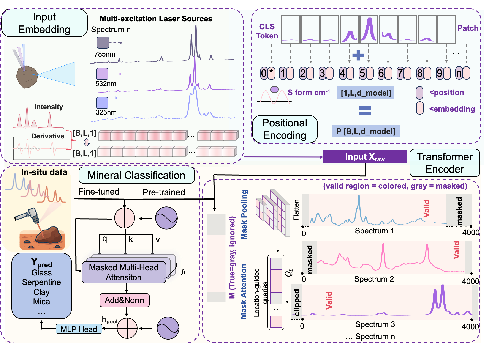

# Physics-Informed Raman Spectral Transformer for Planetary Mineral Identification

This repository contains the data inventory, preprocessing workflow, model comparison code, and reproducible examples for a Raman mineral-identification study aimed at planetary and Mars rover spectroscopy.

Repository URL: <https://github.com/0TT0820/Masked-Spectral-Transformer>

The repository is designed for peer review and reuse. It includes non-compressed parent spectra, spectrum-level metadata, fixed group-wise train/validation/test splits, baseline models, the Masked Spectral Transformer (MST), and scripts for Raman-aware data augmentation with parent-level lineage.


## Repository Status

This is a transparent research repository. The included parent dataset is sufficient to reproduce the main model-comparison tables in the manuscript. Legacy augmented spectra from earlier experiments are documented in metadata, but most legacy augmented filenames did not encode exact parent-spectrum identifiers. For final reproducible augmentation, use `src/augment_raman_dataset.py`, which records `parent_spectrum_id`, random seed, and augmentation parameters for every generated spectrum.

## Contents

```text
publication_repo/
  data/
    metadata/                 Spectrum-level metadata and split files
    overview/                  Data-source and augmentation overview tables
      review_data_inventory/   Review-facing provenance and data-flow tables
    spectra/parent/            945 non-compressed parent Raman spectra
  assets/
    figures/                   Figures extracted from the manuscript
  docs/
    augmentation_rationale.md  Physical basis and limits of augmentation
    data_guide.md              Dataset provenance and metadata fields
    reproducibility.md         Commands used to reproduce model tables
    user_guide.md              Inputs, outputs, options, and expected behaviour
    tutorials/                 Step-by-step examples
  results/
    model_comparison/          Published comparison summaries
    reviewer_requested_baselines/
                                PCA-SVM, PLS-DA, CNN, Transformer, and MST
                                hyperparameter-selection summaries
    confidence_threshold_analysis/
                                Precision/recall/FPR/coverage scans for
                                reviewer-requested operating thresholds
    sherloc_finetune/           SHERLOC region fine-tuning and LOSO transfer
    mst_focused_tuning/         MST-focused tuning artifacts without weights
  src/
    train_review_comparison.py Model comparison and evaluation script
    augment_raman_dataset.py   Reproducible Raman-aware augmentation script
  LICENSE
  DATA_LICENSE.md
  README.md
  requirements.txt
  environment.yml
```

## Installation

Create a Python environment:

```bash
conda env create -f environment.yml
conda activate raman-mst
```

Alternatively, with `pip`:

```bash
python -m venv .venv
.venv\Scripts\activate
pip install -r requirements.txt
```

The code was tested with Python 3.11 on Windows with CUDA-enabled PyTorch. CPU execution is supported for chemometric baselines and small tests, but Transformer training is faster on a GPU.

## Quick Start

Run the main model comparison:

```bash
python src/train_review_comparison.py --models pca_svm pls_da random_forest cnn standard_transformer mst --epochs 180 --batch-size 16 --lr 1e-4 --baseline poly --chemometric-stride 8 --no-augment
```

Generate Raman-aware augmented spectra with parent-level lineage:

```bash
python src/augment_raman_dataset.py --target-per-class 200 --seed 2024
```

Run a fast smoke test:

```bash
python src/train_review_comparison.py --models pca_svm pls_da --baseline poly --chemometric-stride 8
```

## Reviewer-Driven Update

The latest revision artifacts added for the resubmission are organized by
reviewer concern:

- Baseline adequacy and hyperparameter selection:
  `results/reviewer_requested_baselines/`
- Materialized, point-wise augmented spectra:
  `data/materialized_augmented_review_ready_v1/`
- SHERLOC region labels and fine-tuning inputs:
  `data/metadata/metadata_parent_945_plus_sherloc_regions_table1_training_ready.csv`
  and `data/overview/sherloc_regions/`
- SHERLOC fine-tuning and leave-one-target/region summaries:
  `results/sherloc_finetune/`
- Confidence-threshold and rejection analysis:
  `results/confidence_threshold_analysis/`
- MST-focused tuning records, excluding large model weights:
  `results/mst_focused_tuning/`

The corresponding scripts are in `src/`:

```text
build_materialized_augmented_dataset.py
build_sherloc_region_dataset.py
run_review_model_selection.py
run_sherloc_finetune_protocol.py
run_confidence_threshold_analysis.py
run_mst_focused_tuning.py
summarize_reviewer_requested_baselines.py
summarize_hyperparameter_selection.py
summarize_all_requested_confidence_thresholds.py
```

## Main Result Summary

The current best model summary is provided in:

```text
results/model_comparison/best_by_model_summary.csv
```

In the current group-wise split, MST gives the strongest macro-F1 among the tested models, while Random Forest gives a similar accuracy but lower macro-F1.



## Data Provenance

The parent dataset contains 945 spectra:

- RRUFF database: 791 spectra
- Laboratory-acquired DUV spectra: 119 spectra
- SHERLOC in-situ spectra: 31 spectra
- Martian meteorite spectra: 4 spectra

See `docs/data_guide.md` and `data/overview/parent_by_source_type.csv` for details.

### Raw Data Visibility

The raw parent spectra are intentionally stored as individual, non-compressed CSV files:

```text
data/spectra/parent/
```

Each file is linked to a stable `spectrum_id` in:

```text
data/metadata/metadata_parent_945.csv
data/metadata/metadata_parent_945_rruff_enriched.csv
data/metadata/repository_spectra_index.csv
data/metadata/rruff_official_header_metadata.csv
```

Key provenance summary tables are directly visible in:

```text
data/overview/parent_by_source_type.csv
data/overview/parent_by_source_and_category.csv
data/overview/parent_by_excitation_and_source.csv
data/overview/parent_provenance_inventory.csv
data/overview/review_data_inventory/dataset_stage_summary.csv
data/overview/review_data_inventory/dataset_flow_by_review_class.csv
data/overview/review_data_inventory/spectrum_level_provenance_review.csv
```

No `.zip`, `.rar`, or `.7z` archive is required to inspect the dataset.

The review-facing inventory separates raw parent spectra, review-ready Earth-domain train/validation/test spectra, reproducible augmentation targets, SHERLOC external/candidate transfer groups, and excluded halide spectra. This is the recommended table set for responding to data-transparency reviewer comments.

RRUFF-derived spectra include official header metadata parsed from the downloaded RRUFF text spectra, including mineral name, chemistry, locality, source collection, owner, identification status, and official RRUFF URL.

## Figures

Manuscript figures extracted from the Word document are stored in:

```text
assets/figures/
```

See `docs/figure_gallery.md` for the full list and captions. The current repository augmentation workflow is documented in `docs/augmentation_rationale.md`; it preserves Raman band positions and should be used instead of the legacy augmentation schematic for final reproducible runs.

## License

Code is released under the MIT License. Dataset tables and spectra are released under CC BY 4.0 unless a third-party source imposes additional attribution requirements. RRUFF-derived records must retain RRUFF attribution. See `DATA_LICENSE.md`.

## Citation

If you use this repository, please cite the associated manuscript and the source databases listed in `data/metadata/metadata_parent_945.csv`.
## Materialized augmented review dataset

The reviewer-ready augmented dataset is provided in
`data/materialized_augmented_review_ready_v1/`. It is not a compressed archive.
The dataset contains one CSV file per spectrum in `spectra/`; each file contains
the complete point-wise values used by the models:

- `raman_shift_cm-1`
- `intensity_normalized`
- `first_derivative_normalized`
- `valid_mask`

The master table
`data/materialized_augmented_review_ready_v1/metadata_review_ready_materialized_augmented.csv`
links every original and augmented spectrum to its mineral label, source,
split, parent spectrum, file path, SHA-256 checksum, augmentation seed, and
JSON-encoded augmentation parameters. Summary tables are in
`data/materialized_augmented_review_ready_v1/overview_tables/`, including
`lineage_manifest.csv` and `split_by_class_and_augmentation.csv`.

The deterministic augmentation protocol is recorded in
`data/materialized_augmented_review_ready_v1/augmentation_protocol.json`.
Raman band centers are not shifted during augmentation. Only the training split
is augmented; validation and test spectra remain original materialized spectra.

To rebuild the materialized dataset:

```bash
python src/build_materialized_augmented_dataset.py \
  --metadata-file data/metadata_outputs/metadata_parent_945.csv \
  --out-dir data/materialized_augmented_review_ready_v1 \
  --min-train-per-class 200 \
  --baseline poly
```

To rerun the final reviewer-ready model comparison on the fixed materialized
dataset:

```bash
python src/train_review_comparison.py \
  --metadata-file data/materialized_augmented_review_ready_v1/metadata_review_ready_materialized_augmented.csv \
  --models pca_svm pls_da random_forest cnn standard_transformer mst \
  --epochs 80 \
  --batch-size 16 \
  --lr 3e-5 \
  --baseline none \
  --no-augment \
  --out-dir results/materialized_augmented_rerun
```

The reported final comparison is archived at
`results/model_comparison_materialized_augmented.csv`, with the corresponding
run manifest in `results/experiment_manifest_materialized_augmented.json`.

## Confidence Threshold Analysis

Reviewer-requested confidence threshold sweeps are archived in:

```text
results/confidence_threshold_analysis/
```

Key files:

- `parent_test_key_thresholds_all_requested_models.csv`
- `parent_test_recommended_operating_points_all_requested_models.csv`
- `all_confidence_threshold_sweeps.csv`
- `reviewer_requested_models_confidence_summary.md`

These files report accuracy, macro-F1, precision, recall, false-positive rate,
and coverage after rejecting predictions below a probability threshold.
