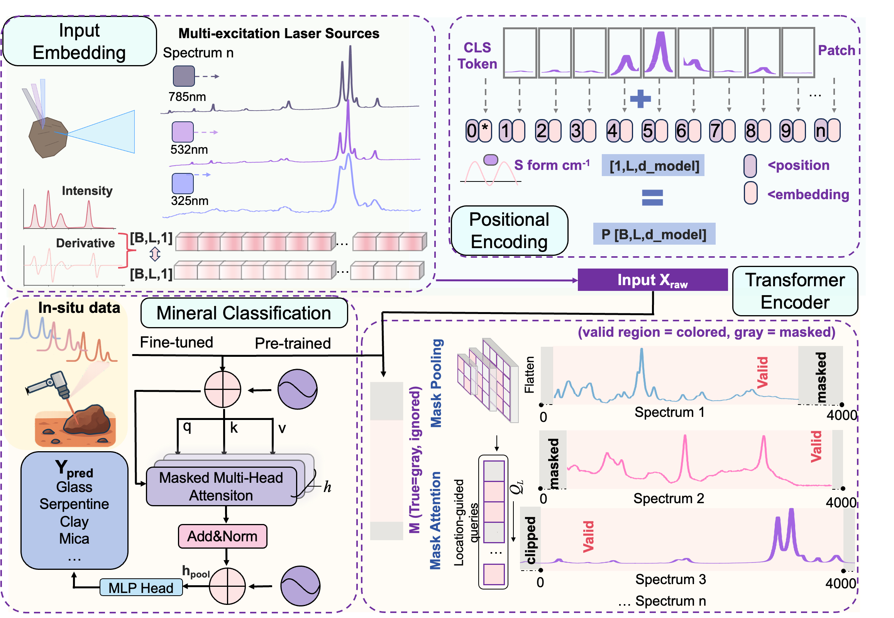

# Physics-Informed Raman Spectral Transformer for Planetary Mineral Identification

This repository contains the data inventory, preprocessing workflow, model comparison code, and reproducible examples for a Raman mineral-identification study aimed at planetary and Mars rover spectroscopy.

Repository URL: <https://github.com/0TT0820/Masked-Spectral-Transformer>

The repository is designed as an open research package for reproduction and reuse. It includes non-compressed parent spectra, spectrum-level metadata, fixed group-wise train/validation/test splits, baseline models, the Masked Spectral Transformer (MST), and scripts for Raman-aware data augmentation with parent-level lineage.


## Repository Status

This is a transparent research repository. The included parent dataset is sufficient to reproduce the main model-comparison tables in the manuscript. Legacy augmented spectra from earlier experiments are documented in metadata, but most legacy augmented filenames did not encode exact parent-spectrum identifiers. For final reproducible augmentation, use `src/augment_raman_dataset.py`, which records `parent_spectrum_id`, random seed, and augmentation parameters for every generated spectrum.

## Contents

```text
publication_repo/
  data/
    metadata/                 Spectrum-level metadata and split files
    overview/                  Data-source and augmentation overview tables
      data_inventory/   Detailed provenance and data-flow tables
      training_database_v2/
                                All-source and DUV-library count tables
    spectra/parent/            945 non-compressed parent Raman spectra
    sherloc_sau008_calibration/
                                SHERLOC SaU 008 calibration-target mean spectra
  assets/
    figures/                   Figures extracted from the manuscript
  docs/
    augmentation_rationale.md  Physical basis and limits of augmentation
    data_and_results_guide.md  Map of data products, scripts, and outputs
    data_guide.md              Dataset provenance and metadata fields
    reproducibility.md         Commands used to reproduce model tables
    user_guide.md              Inputs, outputs, options, and expected behaviour
    tutorials/                 Step-by-step examples
  results/
    model_comparison/          Published comparison summaries
    model_benchmarks/
                                PCA-SVM, PLS-DA, CNN, Transformer, and MST
                                hyperparameter-selection summaries
    confidence_threshold_analysis/
                                Precision/recall/FPR/coverage scans for
                                confidence-aware operating thresholds
    confidence_threshold_materialized_v3/
                                Final key operating thresholds for the
                                materialized reference benchmark and SHERLOC
                                in-situ pooled validation
    review_updated_training_v2/
                                Updated reviewer-oriented rerun on the v2
                                all-source and SHERLOC DUV training database
    sherloc_in_situ_model_comparison_v3/
                                PCA-SVM, PLS-DA, CNN, Transformer, and MST
                                comparison on pooled labeled SHERLOC in-situ
                                spectra
    sherloc_finetune/           SHERLOC region fine-tuning and LOSO transfer
    mst_focused_tuning/         MST-focused tuning artifacts without weights
  src/
    train_model_comparison.py Model comparison and evaluation script
    augment_raman_dataset.py   Reproducible Raman-aware augmentation script
    build_training_database_v2.py
                                Rebuilds the all-source and DUV training tables
  LICENSE
  DATA_LICENSE.md
  README.md
  requirements.txt
  environment.yml
```

## Installation

Create a Python environment:

```bash
conda env create -f environment.yml
conda activate raman-mst
```

Alternatively, with `pip`:

```bash
python -m venv .venv
.venv\Scripts\activate
pip install -r requirements.txt
```

The code was tested with Python 3.11 on Windows with CUDA-enabled PyTorch. CPU execution is supported for chemometric baselines and small tests, but Transformer training is faster on a GPU.

## Quick Start

Run the main model comparison:

```bash
python src/train_model_comparison.py --models pca_svm pls_da random_forest cnn standard_transformer mst --epochs 180 --batch-size 16 --lr 1e-4 --baseline poly --chemometric-stride 8 --no-augment
```

Generate Raman-aware augmented spectra with parent-level lineage:

```bash
python src/augment_raman_dataset.py --target-per-class 200 --seed 2024
```

Rebuild the current all-source training database and DUV spectral library:

```bash
python src/build_sherloc_sau008_calibration_dataset.py
python src/build_training_database_v2.py
```

Run a fast smoke test:

```bash
python src/train_model_comparison.py --models pca_svm pls_da --baseline poly --chemometric-stride 8
```

## Data and Experiment Guide

For a guided map of data products, scripts, and result files, start with:

```text
docs/data_and_results_guide.md
```

The main project components are:

- Model benchmarks and hyperparameter selection:
  `results/model_benchmarks/`
- Materialized, point-wise augmented spectra:
  `data/augmented_spectra_v3/`
- Final materialized-augmentation model selection:
  `results/materialized_augmented_v3_model_selection/`
- SHERLOC region labels and fine-tuning inputs:
  `data/metadata/metadata_parent_945_plus_sherloc_regions_table1_training_ready.csv`
  and `data/overview/sherloc_regions/`
- Current all-source training database:
  `data/metadata/metadata_training_database_v2_all_sources.csv`
- Current DUV spectral library for supervised DUV training, SHERLOC fine-tuning,
  and unlabeled SHERLOC domain adaptation:
  `data/metadata/metadata_duv_training_library_v1.csv`
  and `data/overview/training_database_v2/`
- SHERLOC SaU 008 calibration-target DUV spectra:
  `data/metadata/metadata_sherloc_sau008_calibration_mean_spectra.csv`
  and `data/overview/sherloc_sau008_calibration/`
- Caltech/JPL SHERLOC-analog 62-mineral library import audit:
  `data/metadata/metadata_caltech_sherloc_duv_62min_import_audit.csv`
  and `docs/caltech_sherloc_duv_62min_import_status.md`
- Montpezat/Alfalfa PDS-traceable weak-label candidates:
  `data/metadata/metadata_sherloc_montpezat_alfalfa_weak_candidates.csv`
  and `data/metadata/sherloc_montpezat_alfalfa_pds_products.csv`
- SHERLOC fine-tuning and leave-one-target/region summaries:
  `results/sherloc_finetune/`
- Confidence-threshold and rejection analysis:
  `results/confidence_threshold_analysis/`
- Final confidence-threshold tables for the materialized benchmark and pooled
  SHERLOC in-situ validation:
  `results/confidence_threshold_materialized_v3/`
- Pooled labeled SHERLOC in-situ model comparison:
  `results/sherloc_in_situ_model_comparison_v3/`
- MST-focused tuning records, excluding large model weights:
  `results/mst_focused_tuning/`
- Updated reviewer-oriented rerun on the v2 all-source and SHERLOC DUV
  training database:
  `results/review_updated_training_v2/`

The corresponding scripts are in `src/`:

```text
augment_raman_dataset.py
build_compact_v3_metadata.py
build_mlrod_catalog_and_overlap.py
build_mlrod_integrated_dataset_v3.py
build_materialized_augmented_dataset.py
download_mlrod_raw_raman.py
build_sherloc_region_dataset.py
build_sherloc_pds_provenance.py
build_sherloc_montpezat_alfalfa_candidates.py
build_sherloc_sau008_calibration_dataset.py
build_training_database_v2.py
run_model_selection.py
run_mlrod_integrated_model_comparison_v3.py
run_sherloc_finetune_protocol.py
run_confidence_threshold_analysis.py
run_mst_focused_tuning.py
run_review_updated_training_v2.py
run_mst_extra_v2.py
run_sherloc_preprocessing_trials_v2.py
run_sherloc_adaptation_strategies_v2.py
analyze_sherloc_operating_points_v2.py
run_sherloc_pooled_random_validation_v2.py
run_sherloc_in_situ_model_comparison_v3.py
summarize_materialized_v3_confidence_thresholds.py
summarize_model_benchmarks.py
summarize_hyperparameter_selection.py
summarize_all_requested_confidence_thresholds.py
```

## MLROD-Integrated v3 Workflow

The latest reviewer-oriented workflow integrates the original curated Raman
database with the single-mineral spectra from MLROD (Berlanga et al., 2022;
dataset DOI: 10.48484/PWRB-R137). The full generated v3 metadata table is not
tracked in Git because it exceeds the ordinary GitHub single-file limit; instead,
this repository tracks a compact audit table:

```text
data/metadata/metadata_training_database_v3_compact.csv
```

The full table can be regenerated locally after downloading the MLROD raw Raman
files:

```bash
python src/download_mlrod_raw_raman.py
python src/build_mlrod_integrated_dataset_v3.py
python src/build_compact_v3_metadata.py
```

The current MLROD-integrated model comparison, SHERLOC fine-tuning run, and
spectral-window sensitivity analysis are summarized in:

```text
results/mlrod_integrated_training_v3/mlrod_v3_20260526_223913/MLROD_integrated_experiment_summary.md
results/sherloc_in_situ_model_comparison_v3_mlrod_context/SHERLOC_all_model_threshold_summary.md
results/mlrod_spectral_window_sensitivity_v3/spectral_window_sensitivity_summary.md
```

These runs compare PCA-SVM, PLS-DA, 1D-CNN, Standard Transformer, and MST using
validation-set hyperparameter selection. The spectral-window sensitivity
analysis repeats the MLROD-integrated benchmark with `0-4000`, `100-1800`, and
`800-1800 cm-1` grids to verify that the model ranking is not an artifact of
zero-filled regions outside MLROD's original spectral coverage.

## Main Result Summary

The final materialized-augmentation model-selection summary is provided in:

```text
results/materialized_augmented_v3_model_selection/curated_20260519_104300/reviewer_requested_model_test_summary.csv
```

The reviewer-requested comparison includes PCA-SVM, PLS-DA, 1D-CNN, Standard
Transformer, and MST. On the held-out reference test split, MST and Standard
Transformer have the same accuracy (0.767), while MST has the higher macro-F1
(0.658 versus 0.634). A separate pooled labeled SHERLOC in-situ random-split
validation is archived in `results/sherloc_in_situ_model_comparison_v3/`; in
that within-domain SHERLOC setting, MST gives the highest mean weighted-F1 and
present-label macro-F1 among the tested models.

The final confidence-threshold summaries are provided in:

```text
results/confidence_threshold_materialized_v3/
```



## Data Provenance

The parent dataset contains 945 spectra:

- RRUFF database: 791 spectra
- Laboratory-acquired DUV spectra: 119 spectra
- SHERLOC in-situ spectra: 31 spectra
- Martian meteorite spectra: 4 spectra

See `docs/data_guide.md` and `data/overview/parent_by_source_type.csv` for details.

The current training database extends the parent inventory with additional
PDS-traceable SHERLOC DUV products:

- All-source metadata rows: 1,683
- DUV spectral-library rows: 885
- DUV rows usable as supervised labels: 849
- DUV rows reserved for unlabeled domain adaptation or manual review: 36

The DUV spectral library merges laboratory DUV spectra, labeled SHERLOC
in-situ Mars 2020 spectra, and SHERLOC SaU 008 calibration-target spectra.
Rows are not treated identically during training: labeled laboratory and
in-situ rows can be used for supervised mineral classification or SHERLOC
fine-tuning, whereas SaU 008 rows are real SHERLOC DUV calibration-target
measurements but do not provide point-level mineral labels in the PDS products
and are therefore marked for domain adaptation/manual review only.

```text
data/metadata/metadata_training_database_v2_all_sources.csv
data/metadata/metadata_duv_training_library_v1.csv
data/overview/training_database_v2/
docs/training_database_v2.md
```

### Raw Data Visibility

The raw parent spectra are intentionally stored as individual, non-compressed CSV files:

```text
data/spectra/parent/
```

Each file is linked to a stable `spectrum_id` in:

```text
data/metadata/metadata_parent_945.csv
data/metadata/metadata_parent_945_rruff_enriched.csv
data/metadata/repository_spectra_index.csv
data/metadata/rruff_official_header_metadata.csv
```

Key provenance summary tables are directly visible in:

```text
data/overview/parent_by_source_type.csv
data/overview/parent_by_source_and_category.csv
data/overview/parent_by_excitation_and_source.csv
data/overview/parent_provenance_inventory.csv
data/metadata/sherloc_pds_product_provenance.csv
data/metadata/sherloc_spectrum_to_pds_crosswalk.csv
data/overview/data_inventory/dataset_stage_summary.csv
data/overview/data_inventory/dataset_flow_by_class.csv
data/overview/data_inventory/spectrum_level_provenance.csv
```

No `.zip`, `.rar`, or `.7z` archive is required to inspect the dataset.

The detailed inventory separates raw parent spectra, Earth-domain train/validation/test spectra, reproducible augmentation targets, SHERLOC external/candidate transfer groups, and excluded halide spectra.

RRUFF-derived spectra include official header metadata parsed from the downloaded RRUFF text spectra, including mineral name, chemistry, locality, source collection, owner, identification status, and official RRUFF URL.

SHERLOC-derived spectra include PDS product-level provenance in
`data/metadata/sherloc_pds_product_provenance.csv`, including direct PDS CSV and
XML label URLs, PDS logical identifiers, bundle DOI, observation times, and
upstream raw/intermediate product logical identifiers. The companion
`data/metadata/sherloc_spectrum_to_pds_crosswalk.csv` links each local point
spectrum row to the corresponding PDS product.

Montpezat and Alfalfa products from Figure 4/related SHERLOC target analyses
are included as a separate weak-label candidate set. These rows are
PDS-traceable but are marked `sherloc_training_label_usable=False` because the
available literature provides scan-level mineral detections rather than the
point-level label workbook used for the default SHERLOC fine-tuning dataset.

## Figures

Manuscript figures extracted from the Word document are stored in:

```text
assets/figures/
```

See `docs/figure_gallery.md` for the full list and captions. The current repository augmentation workflow is documented in `docs/augmentation_rationale.md`; it preserves Raman band positions and should be used instead of the legacy augmentation schematic for final reproducible runs.

## License

Code is released under the MIT License. Dataset tables and spectra are released under CC BY 4.0 unless a third-party source imposes additional attribution requirements. RRUFF-derived records must retain RRUFF attribution. See `DATA_LICENSE.md`.

## Citation

If you use this repository, please cite the associated manuscript and the source databases listed in `data/metadata/metadata_parent_945.csv`.
## Materialized Augmented Dataset

The current materialized augmented dataset is provided in
`data/augmented_spectra_v3/`. It is not a compressed archive.
The dataset contains one CSV file per spectrum. Original spectra are
preprocessed and written to `original_spectra/`; deterministic augmented
training spectra are written to `spectra/`.

The master table
`data/augmented_spectra_v3/metadata_augmented_training.csv`
links every original and augmented spectrum to its mineral label, source,
split, parent spectrum, file path, augmentation seed, and JSON-encoded
augmentation parameters. Summary tables include
`split_by_class_and_augmentation.csv` and
`source_by_class_and_augmentation.csv`.

Raman band centers are not shifted during augmentation. Only the training split
is augmented; validation and test spectra remain preprocessed, unaugmented
measured spectra.

To rebuild the materialized dataset:

```bash
python src/augment_raman_dataset.py \
  --metadata data/metadata/metadata_parent_945.csv \
  --out-dir data/augmented_spectra_v3 \
  --target-per-class 200 \
  --seed 2024
```

To rerun the final model comparison on the fixed materialized dataset:

```bash
python src/run_model_selection.py \
  --metadata-file data/augmented_spectra_v3/metadata_augmented_training.csv \
  --out-dir results/materialized_augmented_v3_model_selection \
  --baseline none \
  --min-per-class 200 \
  --max-per-class 260 \
  --epochs 120 \
  --batch-size 24 \
  --refresh-cache
```

The reviewer-requested comparison table from the current rerun is archived at
`results/materialized_augmented_v3_model_selection/curated_20260519_104300/reviewer_requested_model_test_summary.csv`.

## Confidence Threshold Analysis

Legacy confidence threshold sweeps are archived in:

```text
results/confidence_threshold_analysis/
```

Key files:

- `parent_test_key_thresholds_all_requested_models.csv`
- `parent_test_recommended_operating_points_all_requested_models.csv`
- `all_confidence_threshold_sweeps.csv`
- `model_confidence_summary.md`

These files report accuracy, macro-F1, precision, recall, false-positive rate,
and coverage after rejecting predictions below a probability threshold.

The final confidence-threshold summary for the materialized v3 reference
benchmark and pooled SHERLOC in-situ validation is archived in:

```text
results/confidence_threshold_materialized_v3/
```

Key files:

- `reference_test_key_thresholds_requested_models.csv`
- `sherloc_in_situ_key_thresholds_requested_models.csv`
- `combined_key_thresholds_requested_models.csv`
- `confidence_threshold_summary.md`

To regenerate the final key-threshold tables after rerunning the reference and
SHERLOC experiments:

```bash
python src/summarize_materialized_v3_confidence_thresholds.py
```

## SHERLOC In-Situ Model Comparison

The pooled labeled SHERLOC in-situ comparison is archived in:

```text
results/sherloc_in_situ_model_comparison_v3/
```

It compares PCA-SVM, PLS-DA, 1D-CNN, Standard Transformer, and MST under the
same repeated random-split validation protocol. The output includes aggregate
metrics, per-seed confusion matrices, validation predictions, and
confidence-threshold sweeps.

To rerun:

```bash
python src/run_sherloc_in_situ_model_comparison_v3.py \
  --metadata-file data/metadata/metadata_training_database_v2_all_sources.csv \
  --out-dir results/sherloc_in_situ_model_comparison_v3 \
  --variant despike_sg11_asls \
  --seeds 2024 2025 2026 \
  --epochs 60 \
  --batch-size 32
```
