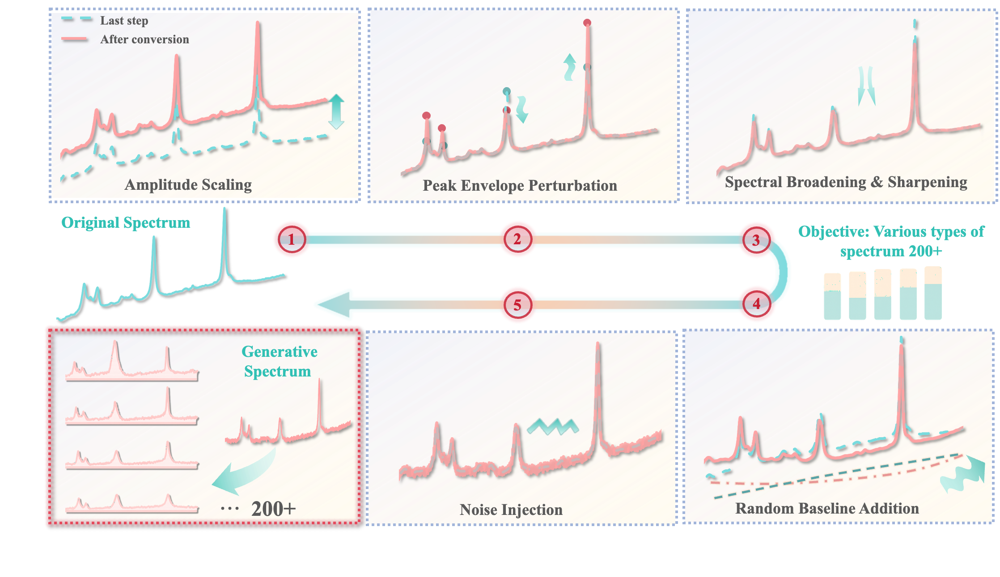
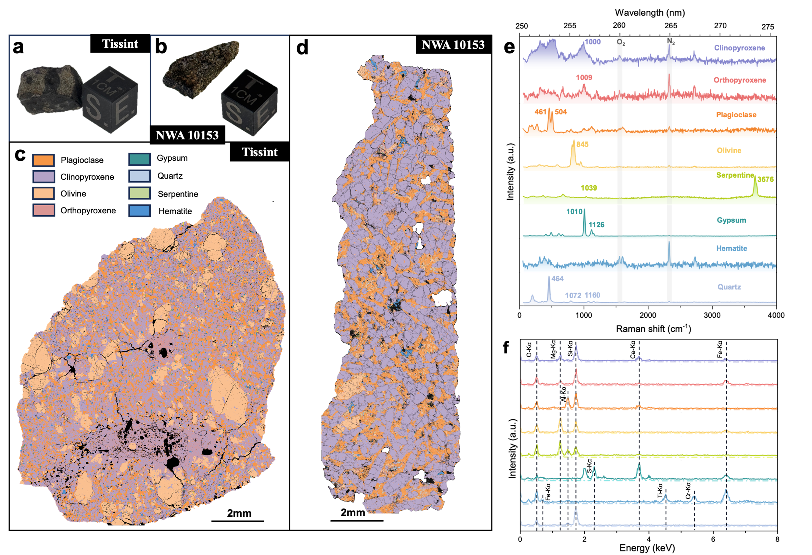
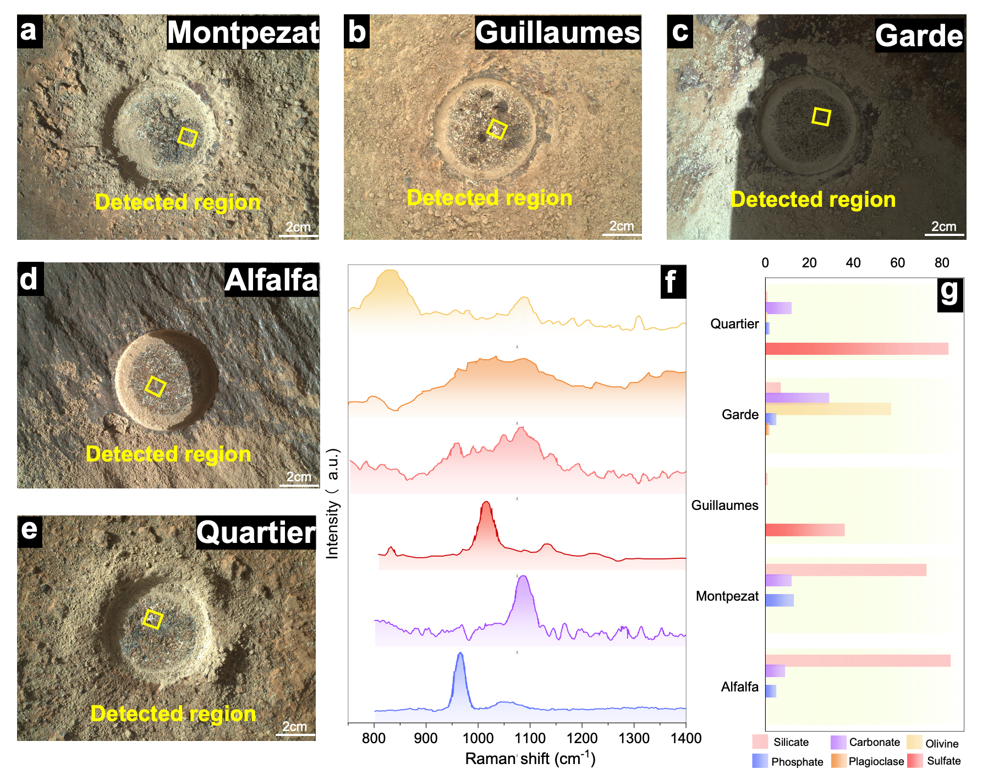
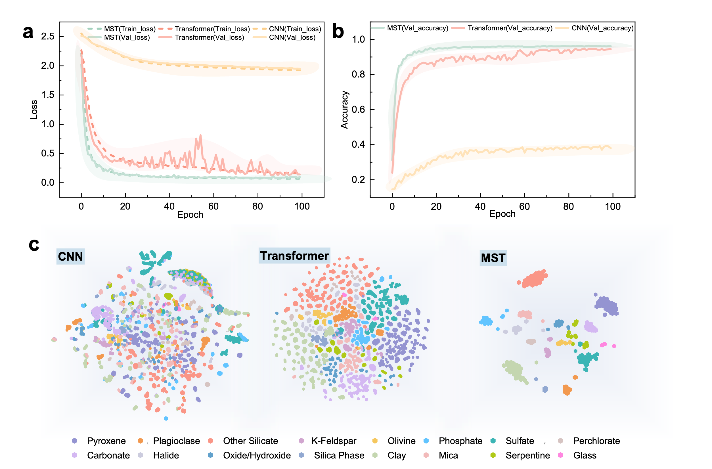
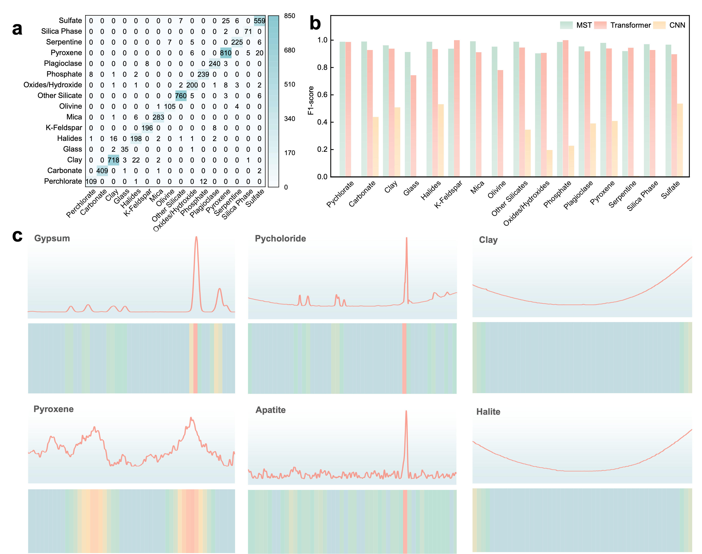

# Figure Gallery

This directory documents manuscript figures extracted from the Word manuscript and stored under `assets/figures/`.

## Graphical Abstract


## Figure 1. Legacy Data Augmentation Schematic



Note: this is a legacy manuscript figure. The reproducible augmentation script in this repository does not randomly shift Raman band positions. See `augmentation_rationale.md`.

## Figure 2. Masked Spectral Transformer Architecture


## Figure 3. Meteorite Dataset and Raman Spectra



## Figure 4. SHERLOC Observation Context



A vector version extracted from the manuscript is also available:

```text
assets/figures/figure_04_sherloc_observations_vector.svg
```

## Figure 5. Training Dynamics and Embeddings



## Figure 6. Classification and Interpretability



## Figure 7. Meteorite Validation


## Figure 8. SHERLOC Validation


